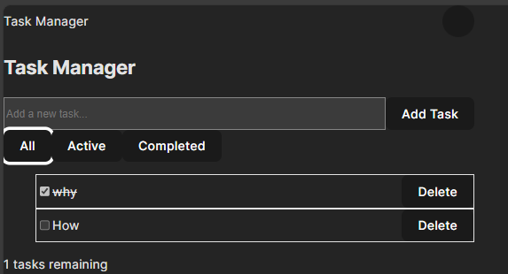

# 📝 React Task Manager – Week 3 Assignment

A responsive React application built with Vite and Tailwind CSS. This project demonstrates component architecture, state management, hooks, and (optionally) API integration.

## ✨ Features

- Add, complete, and delete tasks
- Filter tasks (All, Active, Completed)
- Persistent tasks using localStorage
- Responsive design (mobile, tablet, desktop)
- Light/Dark mode toggle
- Reusable UI components (Button, Card, Navbar, Footer, Layout)
- (Optional) API integration with search and pagination

## 📸 Screenshots




## 🛠️ Setup Instructions

1. **Clone the repository:**
   ```bash
   git clone <your-repo-url>
   cd <your-repo-folder>
   ```

2. **Install dependencies:**
   ```bash
   npm install
   ```

3. **Run the development server:**
   ```bash
   npm run dev
   ```
   The app will be available at the URL shown in your terminal (e.g., http://localhost:5173).


## 🧰 Technologies Used

- [React](https://react.dev/)
- [Vite](https://vitejs.dev/)
- [Tailwind CSS](https://tailwindcss.com/)
- [React Router](https://reactrouter.com/)
- [PropTypes](https://www.npmjs.com/package/prop-types)

## 📄 Assignment Requirements

- Component architecture with reusable components
- State management with hooks and custom hooks
- Theme management with context
- API integration (optional, can be commented out)
- Responsive design with Tailwind CSS

## 👤 Author

S. Johnson

